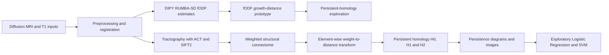
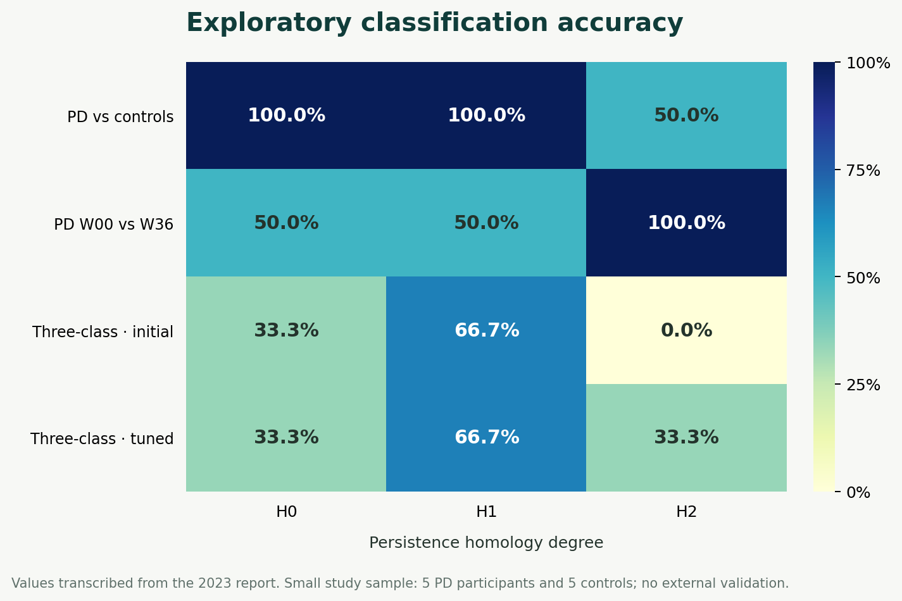

# Topological Analysis of Diffusion MRI in Parkinson's Disease

This research project explores whether topological features derived from diffusion MRI and structural brain connectivity differ between Parkinson's disease (PD) participants and controls, and between two study sessions. The repository contains analysis notebooks, processing scripts, presentations, and the internship report.

The work is exploratory. It investigates candidate imaging features; it does not validate a clinical biomarker or establish a diagnostic model.

## Project overview

| Component | Purpose | Main tools |
|---|---|---|
| Diffusion preprocessing and tractography | Prepare diffusion and structural MRI inputs and construct weighted structural connectomes | MRtrix3, FSL, ANTs, FreeSurfer |
| Fiber-orientation analysis | Estimate and inspect fiber orientation distribution functions (fODFs) | DIPY, RUMBA-SD, FURY |
| Topological analysis | Convert connectome weights into distances, compute persistent homology, and vectorise diagrams | GUDHI, Cripser, Persim |
| Exploratory classification | Compare binary and three-class groupings across homology degrees | scikit-learn, Logistic Regression, SVM |

## Analysis architecture

The report describes two related paths. The initial fODF growth-distance approach proved computationally expensive, so the later group comparisons use structural connectome matrices.



### Analytical data model

| Representation | Shape or grain | Role |
|---|---|---|
| Diffusion MRI | 3D/4D NIfTI volumes with gradient tables in a BIDS-style layout | Source signal for diffusion modelling |
| Weighted connectome | Square matrix with brain parcels as rows and columns | Stores streamline-derived connection weights between regions |
| Distance matrix | Same parcel-by-parcel shape | Created by coefficient-wise inversion of connectome weights in the reported analysis |
| Persistence diagram | Birth/death pairs, computed for H0, H1 and H2 | Summarises topological features across filtration scales |
| Persistence image | Fixed-grid vector representation of a persistence diagram | Input representation for exploratory classifiers |

## Cohorts and data access

The structural-connectome comparison described in the report uses five PD participants from the FAIRPARK-II (FPII) study, with baseline (`W00`) and week-36 (`W36`) sessions, and five control participants from OpenNeuro dataset [`ds001907`](https://openneuro.org/datasets/ds001907). The earlier fODF analysis also uses diffusion data from `ds001907`.

No raw MRI volumes are included. The FPII data are not redistributed by this repository and require the appropriate research access. The README and new summary figure omit participant identifiers and scan images.

## Exploratory results

The figure summarises classification accuracies reported in the 2023 internship report. It makes the variation across hypotheses and homology degrees visible; several cells are at or near chance level.



| Classification task | H0 | H1 | H2 |
|---|---:|---:|---:|
| PD vs controls | 100% | 100% | 50% |
| PD baseline (`W00`) vs week 36 (`W36`) | 50% | 50% | 100% |
| Controls, `W00`, and `W36` — initial three-class experiment | 33.3% | 66.7% | 0% |
| Three-class experiment after the reported tuning | 33.3% | 66.7% | 33.3% |

These percentages are transcribed from the report, not independently reproduced. They are based on a very small study sample, and the repository does not establish external validation. In particular, the perfect scores in some comparisons should not be read as robust predictive performance or proof of a biomarker.

## Reproducing the analysis

The notebooks use local dataset paths, and the shell workflows depend on external neuroimaging tools. Before running them:

1. Obtain the OpenNeuro data and any separately authorised study data you are entitled to use.
2. Place the OpenNeuro dataset in a BIDS-style directory and update the notebook paths. Several notebooks and scripts contain machine-specific absolute paths.
3. Install compatible versions of the Python packages used in the notebooks, including DIPY, nibabel, PyBIDS, NumPy, SciPy, pandas, Matplotlib, GUDHI, Cripser, Persim and scikit-learn.
4. Install the system tools required by the preprocessing scripts: MRtrix3, FSL, ANTs and FreeSurfer.
5. Run the relevant notebook from top to bottom, checking its input paths and output directories first.

There is no pinned `requirements.txt`, environment file, or single command that builds every intermediate result. Treat this repository as an analysis archive that needs local data and toolchain configuration.

## Repository guide

```text
Notebooks/
├── ODFs.ipynb                   Diffusion modelling and fODF exploration
├── TDA.ipynb                    fODF / persistence-homology experiments
├── Tracto2connectomes.ipynb     Tractography and connectome generation
└── Clustering_persimages.ipynb  Persistence-image clustering/classification
FPIIpostprocessing.sh            FPII preprocessing/postprocessing workflow
ds001907preandpostprocessing_1_.sh
                                OpenNeuro preprocessing/postprocessing workflow
Final_report.pdf                Methods, figures, limitations and results
Final_presentation.pdf          Project presentation
README.md                       Project guide
```

## Interpretation and limitations

- The connectome comparison includes only five PD participants and five controls; repeated sessions do not increase the number of independent participants.
- The growth-distance calculation over a full fODF volume was computationally expensive, which motivated the connectome-based comparison.
- Reported classification performance varies substantially by hypothesis and homology degree. The results are exploratory and are not externally validated.
- Processing depends on large external datasets, software versions, local paths, and system-level neuroimaging packages that are not captured by a pinned environment.
- The report investigates a possible research biomarker; no clinical utility, prognosis, or patient-level decision support has been validated.

## Reference

The complete methods and discussion are in [the internship report](Final_report.pdf). The public diffusion MRI source referenced in the report is [OpenNeuro `ds001907`](https://openneuro.org/datasets/ds001907).
